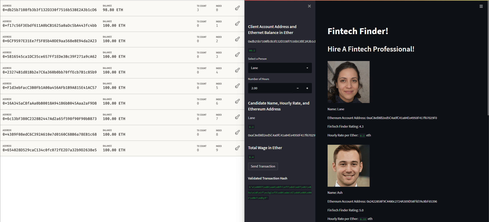

# Unit 19 Homework: Cryptocurrency Wallet

You work at a startup that is building a new and disruptive platform called Fintech Finder. Fintech Finder is an application that its customers can use to find fintech professionals from among a list of candidates, hire them, and pay them. As Fintech Finder’s lead developer, you have been tasked with integrating the Ethereum blockchain network into the application in order to enable your customers to instantly pay the fintech professionals whom they hire with cryptocurrency.

In this Challenge, you will complete the code that enables your customers to send cryptocurrency payments to fintech professionals. To develop the code and test it out, you will assume the perspective of a Fintech Finder customer who is using the application to find a fintech professional and pay them for their work.

---

## Output From Assessment

The following recording shows how the Crytocurrency Wallet operates:

Take note how the number of ETH decreases as a transaction is placed.

---

## How to run this notebook

 * To operate this notebook, you must have Ganache installed and your mnemonic stored in your environment variables.

 * Once completed, navigate (using Terminal) to the cloned repository. Then simply (once navigated to the directory) run the following command `streamlit run fintech_finder.py` to run the notebook.

 * A Streamlit application will then load and you can interact with the dashboard application to send transactions.

